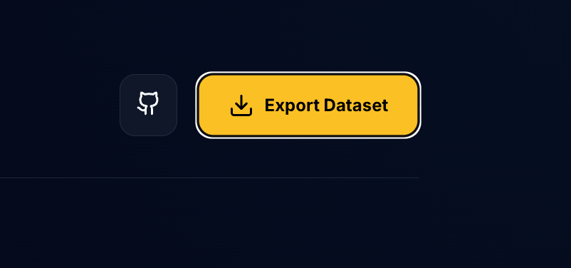
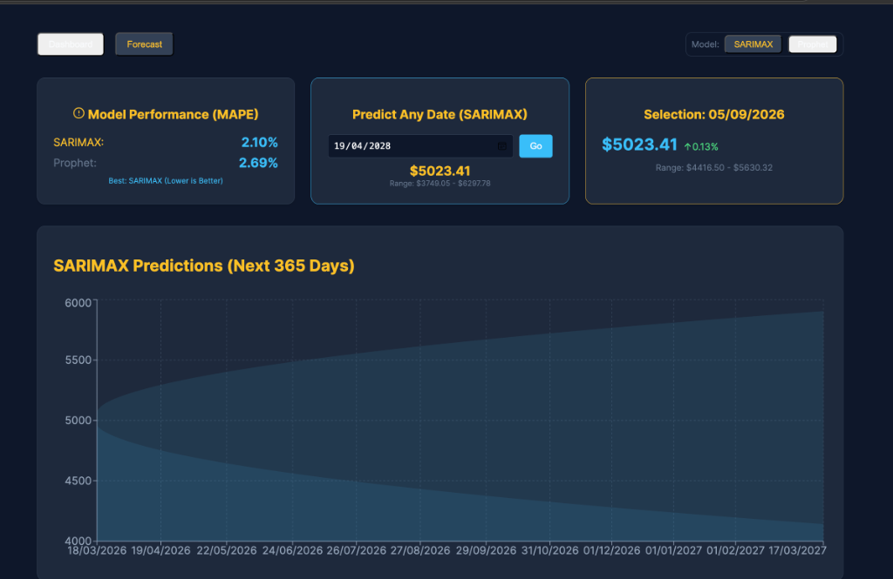

# Aurea Intelligence: Autonomous Gold Forecasting Platform 🥇📈

**Aurea** is a professional-grade financial intelligence engine designed to predict Gold market (XAUUSD) volatility. It combines five years of institutional data with a self-improving ML pipeline to provide high-precision predictive insights.



## 🚀 Key Features

- **Autonomous MLOps Pipeline**: A weekly scheduler fetches fresh market data, retrains models, and only promotes them to production if they beat the current MAPE (Mean Absolute Percentage Error) threshold.
- **Hybrid Predictive Engine**: Leverages both **SARIMAX** (for statistical drift) and **Meta Prophet** (for non-linear seasonality) to provide comprehensive market windows.
- **Interactive Intelligence**: A glassmorphic React dashboard featuring dynamic 1-year projections and custom date inference.
- **Cloud-Native Architecture**: Built with FastAPI, BigQuery, and Docker for seamless scalability.

## 🛠️ Technology Stack

- **Frontend**: React, Vite, Recharts, Lucide-React, Tailwind CSS (Glassmorphism).
- **Backend**: FastAPI, Python 3.11+.
- **Data Engineering**: Google BigQuery, Yahoo Finance API.
- **Machine Learning**: Statsmodels (SARIMAX), Facebook Prophet.
- **DevOps**: Docker, Docker Compose, GitHub Actions (Ready).

## 📊 Forecast Visualization



## 🚦 Getting Started (Local Development)

### Prerequisites
- Docker & Docker Compose
- Google Cloud Service Account (for BigQuery access)

### 1. Setup Environment
1. Clone the repository:
   ```bash
   git clone https://github.com/ShubhamV2503/Gold-Insight-Forecastor.git
   cd Gold-Insight-Forecastor
   ```
2. Place your `credentials.json` (Google Cloud) in the root directory.
3. Create a `.env` file from the `.env.example`.

### 2. Launch with Docker
Run the entire platform with a single command:
```bash
docker-compose up --build
```
- **Frontend**: http://localhost:5173
- **Backend API**: http://localhost:8000

---

## 🦾 The "Self-Improving" Brain (ML Pipeline)
Every Sunday at 00:00, the system triggers the following autonomous workflow:
1. **Fetch**: Latest weekly close prices via YFinance.
2. **Train**: Retrains both Lead and Challenger models.
3. **Validate**: Calculates the MAPE for the new model on hold-out data.
4. **Deploy**: If `New_MAPE < Current_MAPE`, the new model weights are saved to BigQuery and promoted to the dashboard.

---
*Created as a high-performance demonstration of MLOps and Time-Series Forecasting.*
